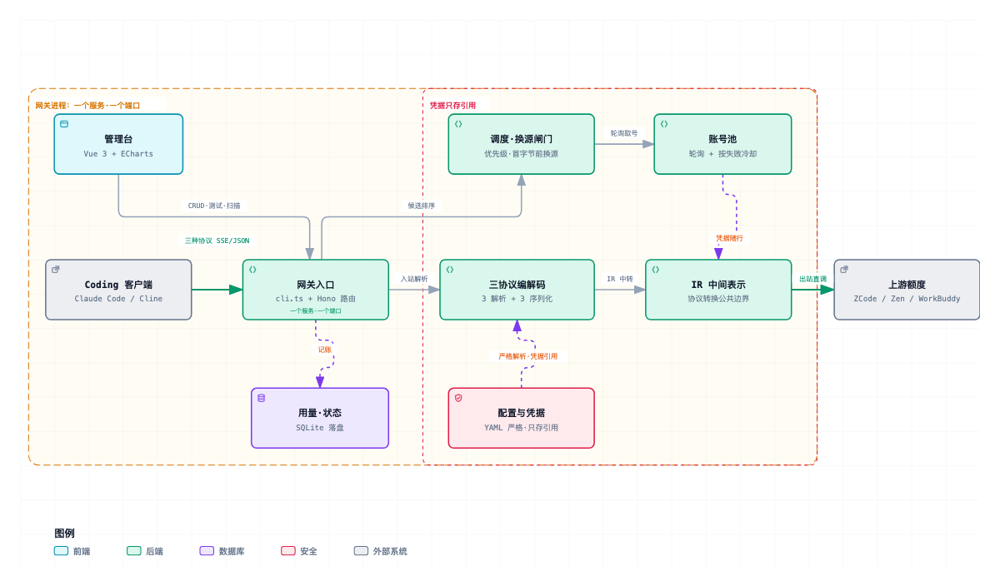

# polycode-hub

[](package.json) [](LICENSE) [](package.json) [](#开发) [](tsconfig.json)

> 免费额度通常绑着自家客户端一起发：想用这份额度，就得用它的 harness。于是你的工具选择权，被 token 拿走了。

多源 Coding Agent **反代网关**：**你想用哪个 harness 就用哪个，不必因为额度去迁就客户端。** 网关把 ZCode / OpenCode Zen / WorkBuddy 等上游汇聚到一个入口，用标准协议对外提供服务。

**额度耗尽自动换源**是它的支撑能力：上游改协议、调限额、额度用完，网关自动切到下一个可用源，你的客户端不用改任何配置。

## 设计取向

**接受免费 token ≠ 我同意。**

上游发的是额度，网关接的是协议——两侧解耦。客户端说什么协议（Anthropic / OpenAI Chat / OpenAI Responses），网关负责翻译给上游；上游是谁、换了几次，客户端不需要知道。

所以：**换 harness 不用换额度，换上游不用改客户端。** 同一个上游接进来只是多一条可用路径，不代表独占，也不影响你继续直连它。

---

## 功能

- **客户端不限**：任何能改 Base URL 的 harness 都能接——Claude Code、Cline 等说 Anthropic 协议的填 `ANTHROPIC_BASE_URL` 即可，OpenAI 兼容工具直接指向网关；换 harness 不影响上游配置
- **上游不限**：任意 `anthropic-messages` / `openai-completions` / `openai-responses` 兼容源都能加，`base_url` 自由填；额度耗尽时在首字节之前自动切换到下一个源（首字节一旦发出即不换源，避免拼接出错误内容）
- **凭据不限**：官方 API Key 是最常规的接法——填 `api_key_env`（走环境变量）或 `api_key_file`（走 `config/credentials/` 下的文件）即可，`access_kind` 默认就是 `official`；登录态复用、本地 sidecar 只是另外两种可选路径。密钥全程不落明文，只存引用
- **三种协议均支持**：`POST /v1/messages`（Anthropic）、`POST /v1/chat/completions`（OpenAI Chat）、`POST /v1/responses`（OpenAI Responses），流式与非流式均可，经 IR 中间表示中转
- **协议自动识别**：`api` 留空即自动探测，首次成功后记住；管理台「扫描可用性」可批量实测并写回
- **账号池**：同源轮询，按失败原因冷却（限流 60s / 额度用尽 600s / 鉴权 1800s）；额度用尽只认人工重置或一次成功的测试
- **管理台**：`http://127.0.0.1:3000/admin/` —— 配 Provider、导账号、看用量、管项目
- **账号健康度**：绿 / 琥珀 / 红一眼看清连败与额度见底，不用翻日志
- **本机发现**：自动扫描 WorkBuddy 登录态、ZCode 安装、OpenCode Zen 连通，点一下完成「采用 Provider + 账号入池」
- **用量统计**：SQLite 落盘；TPS 无有效样本时显示 `—`，不与 0 混淆

完整行为说明（含全部 REST 端点、调度细节、转换丢弃点、口径公式）见 [`docs/FEATURES.md`](docs/FEATURES.md)，每条均可在 `server/src/` 找到对应实现。

---

## 架构



矢量版 [`docs/architecture.svg`](docs/architecture.svg)，图源文件 [`docs/polycode-hub.architecture.json`](docs/polycode-hub.architecture.json)（由 [archify](https://github.com/tt-a1i/archify) 生成）。

---

## 快速开始

前置要求：Node.js **≥ 22.13**（用了 `node:sqlite`；低于此版本起不来）。检查 `node -v`。

以下命令均在**仓库根目录**（含 `package.json` 与 `server/` 的那一层）执行：

```bash
npm run setup   # 装两份依赖 + 构建前端，首次跑一次
npm start
```

启动成功会打印监听地址，浏览器打开 **<http://127.0.0.1:3000/admin/>** 即可。

| 场景 | 命令 |
|---|---|
| 日常启动 | `npm start` |
| 改后端代码自动重启 | `npm run dev`（`tsx watch`） |
| 后台常驻 + 改完前端一键重启 | `./update.sh`（构建前端 → 重启进程 → 健康检查，日志在 `data/gateway.log`） |

> 网关进程自己托管管理台，只有一个服务、一个端口。**改了 `web/` 下的东西要重新构建**（`npm run build:web`）才会生效；开发时用 `npm run dev:web` 走 HMR，不必反复构建。
>
> 报 `EADDRINUSE` 说明 3000 已被占用，通常另有一个实例在跑。先 `curl -sf -o /dev/null http://127.0.0.1:3000/admin/` 确认是否健康——健康就直接用，不必再启。

### 首次配置：不用写配置文件

**零配置启动**后直接进管理台，全部在界面上点：

**接一个官方 API Key 源**（最常规）：Providers 页 → 新建 Provider → 填「名称」（它同时是模型 ID 前缀，如 `acme` → `acme/gpt-x`）、`base_url`、协议（留空即自动探测）、接入方式保持 `official` → API Key 选「直接填 Key」粘进去（或选「用环境变量」填变量名）→ 拉模型列表 → 勾选采用。配置文件等价写法：

```yaml
providers:
  - name: "my-upstream"
    base_url: "https://api.example.com"    # 任意兼容源；anthropic 协议不含 /v1，openai 系含
    api: "anthropic-messages"              # 可留空 = 自动探测
    access_kind: "official"                # 可省略，默认即 official
    credential:
      api_key_env: "MY_UPSTREAM_KEY"       # 或 api_key_file: config/credentials/my-key
```

**接本机已登录的 harness 与免费额度**：

1. **Discover 页 → 一键导入**：自动发现本机装过并登录过的 harness（WorkBuddy / OpenCode Zen 等），点一下就完成「采用 Provider + 账号入池 + 模型目录自动扫描」。导入完直接用 `name/modelId` 调用即可。
   > 模型目录是**扫出来的，不是猜的**——网关不会替你预填模型名。自动扫描拿不到时（上游无列表接口且本机无使用痕迹）会给出提示，请到 Providers 页点「扫描可用性」或手动添加；按未声明的模型名调用会 404。
   > WorkBuddy 类上游**只支持流式**：非流式调用（`stream:false`）会被拒绝并提示开启流式。
2. **ZCode 免费额度**：面板里点「一键安装 / 一键启动」拉起本地 sidecar（首次要从 GitHub 下 ~66MB 二进制，**自动复用项目配置的出口代理**，面板会显示实际走哪个代理）。要 OAuth 登录时到命令行跑 `npx tsx server/src/cli.ts zcode login`（JWT 只打印一次，不保存）。
3. **Providers 页 → 模型**：拉上游模型列表 → 「扫描可用性」自动识别每个模型的协议并记住 → 勾选采用。**勾选 = 对外暴露**：只有勾中的模型会出现在 `/v1/models`（id 为 `name/modelId` 限定名）、参与路由、进入测试下拉。
4. **Providers 页 → 测试**：打一次最小真实请求，确认打通。

---

## 对接方式

网关说三种协议，请求里带 `model` 字段即可（`GET /v1/models` 查可用 id，形态为 `name/modelId`）；不带则用 `gateway.default_model` 兜底。

```bash
# Anthropic Messages（Claude Code / Cline 用这种）
export ANTHROPIC_BASE_URL=http://localhost:3000
curl -N http://127.0.0.1:3000/v1/messages \
  -H 'Content-Type: application/json' \
  -d '{"model":"<providerId>/<modelId>","max_tokens":256,"messages":[{"role":"user","content":"hi"}]}'

# OpenAI Chat Completions
curl -N http://127.0.0.1:3000/v1/chat/completions \
  -H 'Content-Type: application/json' \
  -d '{"model":"<providerId>/<modelId>","stream":true,"messages":[{"role":"user","content":"hi"}]}'

# OpenAI Responses
curl -N http://127.0.0.1:3000/v1/responses \
  -H 'Content-Type: application/json' \
  -d '{"model":"<providerId>/<modelId>","input":"hi"}'
```

网关默认**只监听 `127.0.0.1`** 且**免鉴权**（回环地址安全）。要对局域网/公网暴露，必须在配置文件里设 `gateway.admin_key`，否则拒绝启动。转发面另有 `gateway_key`（非空则 client 须带 `Authorization: Bearer <key>`）。

---

## 配置文件（可选）

零配置能跑，但要固定端口、设口令、预置 Provider 时写 YAML：

```bash
cp config/apps.example.yaml config/apps.yaml
```

`POLYCODE_CONFIG` 可覆盖配置路径。常用改动：

```yaml
gateway:
  port: 3000            # 换端口；也可启动时加 --port 3999
  admin_key: "..."      # 管理台口令；对非回环监听时必填
  gateway_key: ""       # client 侧 Bearer 校验；留空不校验
providers:
  - name: "company-anthropic"
    api: "anthropic-messages"   # 留空 = 自动识别（推荐）
    base_url: "https://gw.example.com"
    credential:
      api_key_env: "COMPANY_GW_KEY"   # 密钥走环境变量，配置不落明文
```

> **注意**：配置文件是**严格模式**——写错字段名会直接拒绝启动，错误信息会点名是哪个字段。示例文件一定是能解析的（有测试守着）。
>
> **存储**：运行时以 SQLite（`data/admin.db`）为准——在管理台上的增删改重启不丢，运维入口以管理台为准。
>
> **凭据热轮换**：改 `config/credentials/` 下的文件内容即生效（下次请求自动读新值），再调 `POST /admin/api/accounts/{id}/recheck` 清冷却立刻恢复，**全程不重启**。`api_key_env` 引的环境变量改值需重启进程。

---

## 命令行

```bash
npx tsx server/src/cli.ts <子命令>     # 或用 bin shim：node bin/polycode-hub.mjs <子命令>
```

| 子命令 | 作用 |
|---|---|
| `serve`（默认） | 启动网关 + 管理台。常用参数：`--port 3999`、`--config <path>` |
| `scan` | 只扫描本机可导入的 harness，不启动服务（`--json` 输出 JSON） |
| `adopt [--id ID] <finding-key>` | 命令行采用某个 harness（如 `workbuddy` / `opencode-zen`） |
| `zcode login` | ZCode OAuth 登录（浏览器授权，一次即可） |
| `zcode sidecar <动作>` | 本地引擎管理：`install` / `setup` / `start` / `stop` / `status` / `login` / `ensure`（缺省 `ensure`）。下载自动复用项目配置的出口代理（`--proxy <url>` 或 `--egress <id>` 可显式指定） |

---

## 管理台（6 个页面）

| 页面 | 作用 |
|---|---|
| Dashboard | 用量仪表盘：365 天热力图 + 归因表 |
| Providers | Provider CRUD + 模型勾选/协议/出口/测试/一键导入 |
| Accounts | 按源分组的账号池 + 健康/测试/重置/签到（一键导入的 WorkBuddy 账号才显示「签到」） |
| Discover | 本机 harness 扫描采用 + 共存登录态导入 + sidecar 管理 |
| Projects | 本机项目一键启停 / 端口冲突 / 日志 |
| Login | 管理口令登录 |

转发面端点：`POST /v1/messages`、`POST /v1/chat/completions`、`POST /v1/responses`（另有裸路径别名 `/chat/completions`、`/responses`）、`GET /v1/models`、免鉴权的 `GET /health`。

---

## 开发

```bash
npm run dev            # 后端热重启（tsx watch）
npm test               # 全量测试（vitest，27 个文件 463 个用例）
npm run typecheck      # tsc --noEmit

npm run dev:web        # 前端 HMR；已配代理把 /admin/api 转给 :3000
```

改后端跑 `npm run dev`；改前端跑 `npm run dev:web`（HMR，不用反复 build）。

> 只有**开发**时前后端才是分开的两个服务：`vite` dev server 占一个端口提供 HMR，并把 `/admin/api` 代理给 3000 端口的后端。生产运行时不涉及这一层——网关进程直接托管 `web/dist`，只有一个端口。

### 工程结构

```
server/src/
├── cli.ts            # 入口与子命令
├── config/           # YAML 严格解析 + 默认值
├── gateway/          # HTTP 挂载、/v1/* 路由、管理台静态托管
├── router/           # 调度：候选排序、模型匹配、上下文预检
├── pool/             # 账号池（轮询 + 冷却）
├── ir/               # 中间表示（协议转换的公共边界）
├── codec/            # 三种协议的解析器 / 序列化器
├── model/            # Provider / Model / Account 类型与校验
├── adminapi/         # 管理台 REST API
├── usage/            # 用量与 token 计量（SQLite）
├── projects/         # 本地项目管理器（启停服务、端口冲突检测）
└── sidecar/          # ZCode 本地引擎托管（只做下载+配置+进程管理，不含上游代码）
web/src/              # Vue 3 + Element Plus + ECharts 管理台
```

**架构要点**：三种协议经 **IR 中间表示**互转（3 解析器 + 3 序列化器，而非 9 套两两转换）。调度按 **Provider 优先级**排序，同级轮转。

---

## 约束与约定

改动代码前需要知道的几条硬约束（完整版见 [`docs/FEATURES.md`](docs/FEATURES.md)）：

- **换源闸门**：一旦向 client 吐出首字节即不可换源，故障转移只在首字节之前发生
- **协议自动识别**：Provider `api` 是默认协议，`models[].api` 可覆盖（扫描实测写入）；留空即自动探测
- **许可证边界**：本项目 MIT，**不得混入具有传染性的开源许可证代码**
- **凭据不落明文**：只引环境变量名或 `config/credentials/` 下的文件
- **Provider 名可改**（模型 ID 前缀跟着变，旧前缀立即失效并给出明确报错）；内部 `providerId` 永不变，账号归属与用量归因按它走；一个 Provider 只说一种协议；baseURL 停在操作路径之前

---

## 许可证

MIT（见 [`LICENSE`](LICENSE)）
